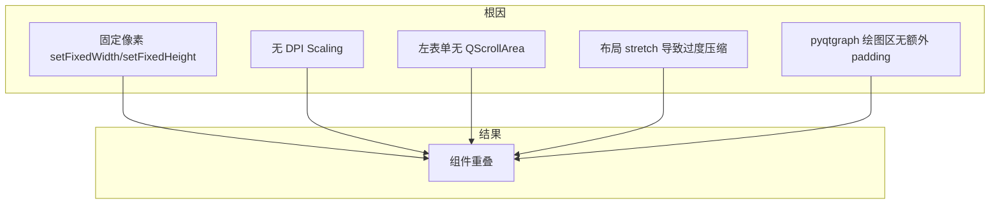

# 修复显示分辨率与组件重叠问题

## 问题分析

根据截图和代码分析，组件重叠主要由以下几类原因导致：

| 问题类型     | 具体表现                     | 涉及位置                                                              |
| -------- | ------------------------ | ----------------------------------------------------------------- |
| 固定像素布局   | 不随 DPI/分辨率缩放             | 左侧表单、图表、底部监测区                                                     |
| 布局比例压缩   | 左 2:右 5 在小屏时左侧过窄         | [test_widget_1.py](widgets/sub_widgets/test_widget_1.py) L84-86   |
| Y 轴与表单紧贴 | 「位移Travel(mm)」贴近左侧输入框    | pyqtgraph 图表左边界                                                   |
| 底部按钮过密   | 力(N)、1-12、Pmax、Pmin 单行挤满 | [test_widget_1.py](widgets/sub_widgets/test_widget_1.py) L530-538 |
| 无 DPI 感知 | 未启用高 DPI 缩放              | [main.py](main.py)                                                |
| 固定字体/尺寸  | 像素单位不随系统缩放               | [styles.qss](resources/styles.qss)、表单控件                           |

---

## 修复方案

### 1. 启用 High DPI 支持

**文件**: [main.py](main.py)

- 在 `QApplication` 实例化**之前**调用：
  - `QtCore.Qt.AA_EnableHighDpiScaling`（如使用 PyQt5）
  - `QtCore.Qt.AA_UseHighDpiPixmaps`
- 使 Qt 使用设备无关像素，适配高 DPI 显示器。

### 2. 左侧表单可滚动化

**文件**: [test_widget_1.py](widgets/sub_widgets/test_widget_1.py)

- 用 `QScrollArea` 包裹 `create_left_form()` 的容器。
- 为左侧区域设置合理 `setMinimumWidth()`（例如 300px），防止被压缩到过窄。
- 保证表单在小分辨率或高 DPI 下仍可完整显示，避免与图表 Y 轴重叠。

### 3. 增加左/右区域间距

**文件**: [test_widget_1.py](widgets/sub_widgets/test_widget_1.py)

- 在 `main_layout` 上增加 `addSpacing()` 或调整 `setSpacing()`，在左侧表单与图表之间留出 10–20px 间距。
- 或在 `create_chart` 中通过 `plot_widget.plotItem.getViewBox().setDefaultPadding(left=...)` 为绘图区左侧增加 padding，为 Y 轴留出空间（注意 pyqtgraph 的 setDefaultPadding 参数）。

### 4. 底部实时监测区优化

**文件**: [test_widget_1.py](widgets/sub_widgets/test_widget_1.py) 中 `create_bottom_grid()`

- 将单行 15 个控件改为两行或使用 `QScrollArea` 水平滚动。
- 或根据可用宽度动态计算列数，避免控件挤在一起导致重叠。

### 5. 样式表与尺寸适配

**文件**: [resources/styles.qss](resources/styles.qss)

- 将关键控件的固定像素字体（如 20px、25px、30px）改为 `pt` 或适度减小，以便随 DPI 和系统缩放。
- 酌情放宽 `min-height` 等固定像素约束，避免在高 DPI 下过于拥挤。

### 6. 主窗口与 Dock 约束

**文件**: [app.py](app.py)

- 将 `resize(2000, 1000)` 调整为基于屏幕尺寸的比例，例如 `screen_width * 0.8`, `screen_height * 0.85`，避免在低分辨率设备上超出屏幕。
- 对 Dock 宽度设置 `setMinimumWidth` 与 `setMaximumWidth` 时，加入下限（例如不小于 200px），避免在小屏时占用过多空间。

---

## 实施优先级

1. **高优先级**：启用 High DPI（main.py）、左侧 QScrollArea + 最小宽度（test_widget_1.py）、左/右区间距
2. **中优先级**：底部监测区布局、主窗口 resize 逻辑
3. **低优先级**：QSS 字体与尺寸适配

---

## 关键代码位置

- 主窗口与 Dock：[app.py](app.py) L23-36, L86-93
- 主视图布局与表单：[test_widget_1.py](widgets/sub_widgets/test_widget_1.py) L78-94, L101-225, L493-510, L526-538
- 应用入口：[main.py](main.py) L7-14
- 全局样式：[resources/styles.qss](resources/styles.qss)

